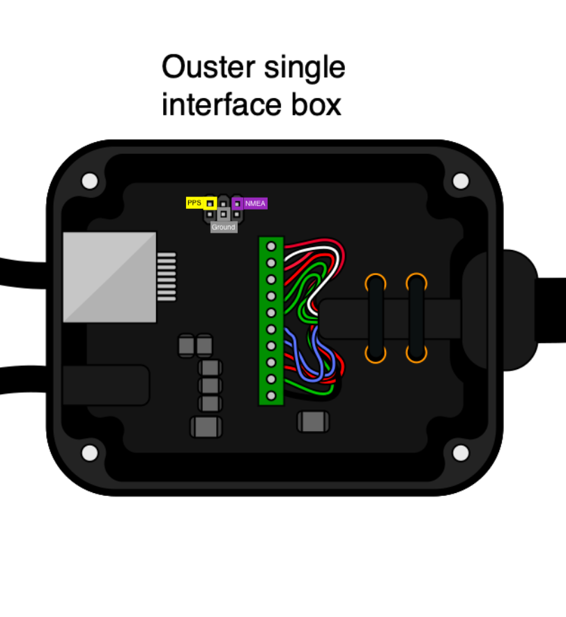
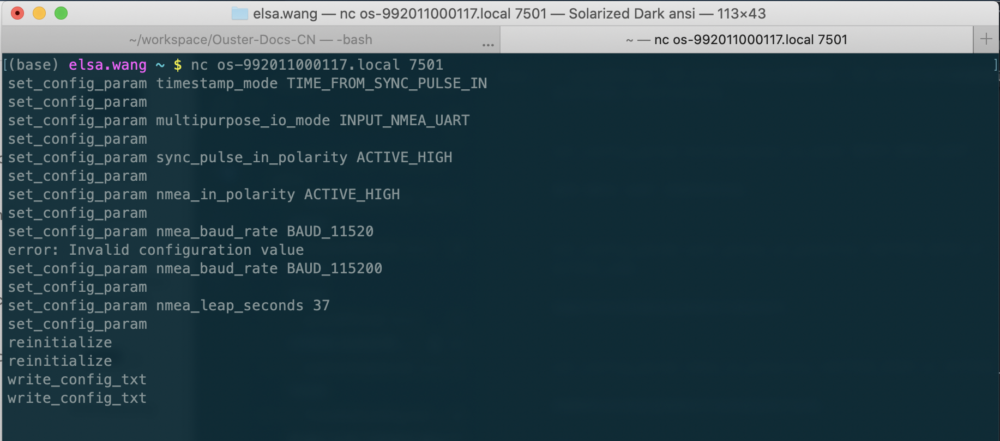

# GPS NMEA 时间同步

## 设置 GPS/GNSS

请根据厂家说明设置您的GPS来符合 Ouster 激光雷达对GPS数据的以下要求：

- NMEA: 目前只能接受GPRMC语句
- 波特率(Baud Rates): 9600 或 115200
- 启用极性(Polarity): 高电平(ACTIVE_HIGH) 或 低电平(ACTIVE_LOW)
- 电压: 3.3 - 15V (最小电流5mA)

**注意** 如果GPS电压不能满足上述最小电压，请参照[《硬件指南》3.2章节](https://data.ouster.io/downloads/hardware-user-guide-v1.13.0.pdf)制作额外的升压电路。

## 连接GPS和转接盒



如上图所示：

0. 拧松转接盒四角的螺丝，打开转接盒。
1. 将GPS的PPS信号线连接到标有 ***sync_pulse_in*** 的pin脚(图上黄色标识)。
2. 将GPS的地线线连接到标有 ***GND*** 的pin脚(图上灰色标识)。
3. 如果使用NMEA同步时间，则将GPS的NMEA UART信号线连接到标有 ***multiputpose_io*** 的pin脚(图上紫色标识)。

## TCP命令配置雷达同步模式

以Linux系统为例，打开命令行窗口，输入 `nc hostname nc` 进入TCP命令控制界面，输入：

```bash
set_config_param timestamp_mode TIME_FROM_SYNC_PULSE_IN
```
使用外部输入信号作为同步源。

```bash
set_config_param multipurpose_io_mode INPUT_NMEA_UART
```
使用 NMEA UART 消息同步时间。

```bash
set_config_param sync_pulse_in_polarity <ACTIVE_HIGH or ACTIVE_LOW>
```
根据GPS的启用极性选择高电平或低电平。

```bash
set_config_param nmea_in_polarity <ACTIVE_HIGH or ACTIVE_LOW>
```
根据NMEA的类型选择高电平启用或低电平启用。

```bash
set_config_param nmea_baud_rate <BAUD_11520 or BAUD_9600>
```
根据GPS的配置选择对应的波特率。

```bash
set_config_param nmea_leap_seconds 37
```
设置闰秒，参考国际原子时([TAI](http://www.leapsecond.com/java/gpsclock.htm))。

```bash
reinitialize
```
重新初始化雷达，使上述设置生效

```bash
write_config_txt
```
保存配置，否则下次上电后配置失效。



## 检查时间同步是否成功

TCP 命令输入 `get_time_info`，雷达将返回JSON格式的内容如下：

```json
{
  "timestamp": {
    "time": 1585881641.96139565999999,
    "mode": "TIME_FROM_SYNC_PUSLE_IN",
    "time_options": {
      "sync_pulse_in": 1585881641,
      "internal_osc": 302,
      "ptp_1588": 309
      }
  },
  "sync_pulse_in": {
    "locked": 1,
    "diagnostics": {
      "last_period_nsec": 10,
      "count_unfiltered": 832,
      "count": 832
    },
    "polarity": "ACTIVE_HIGH"
  },
  "multipurpose_io": {
    "mode": "INPUT_NMEA_UART",
    "sync_pulse_out": {
      "pulse_width_ms": 10,
      "angle_deg": 360,
      "frequency_hz": 1,
      "polarity": "ACTIVE_HIGH"
    },
    "nmea": {
      "baud_rate": "BAUD_9600",
      "diagnostics": {
        "io_checks": {
          "bit_count": 2938457,
          "bit_count_unfilterd": 2938457,
          "start_char_count": 832,
          "char_count": 66526
      },
    "decoding": {
      "last_read_message": "GPRMC,024041.00,A,5107.0017737,N,11402.3291611,W,0.080,323.3,020420,0.0,E,A*20",
      "date_decoded_count": 832,
      "not_valid_count": 0,
      "utc_decoded_count": 832
    }
  },
    "leap_seconds": 37,
    "ignore_valid_char": 0,
    "polarity": "ACTIVE_HIGH"
    }
  }
}
```
其中，
- `”sync_pulse_in": { "locked": 1 ...` 表示雷达接收PPS信号成功。
- `“nmea": { “locked”: 1 ...` 表示雷达接收NMEA消息成功。
- `"decoding": {"last_read_message":` 字段可以验证雷达最后接收到的 GPRMC 消息，例如。
    - `"GPRMC,024041.00,A,5107.0017737,N,11402.3291611,W,0.080,323.3,020420,0.0,E,A*20"`
- `"timestamp": { "time": 1585881641.96139565999999,` 为同步后时间。

---
[回首页](README)